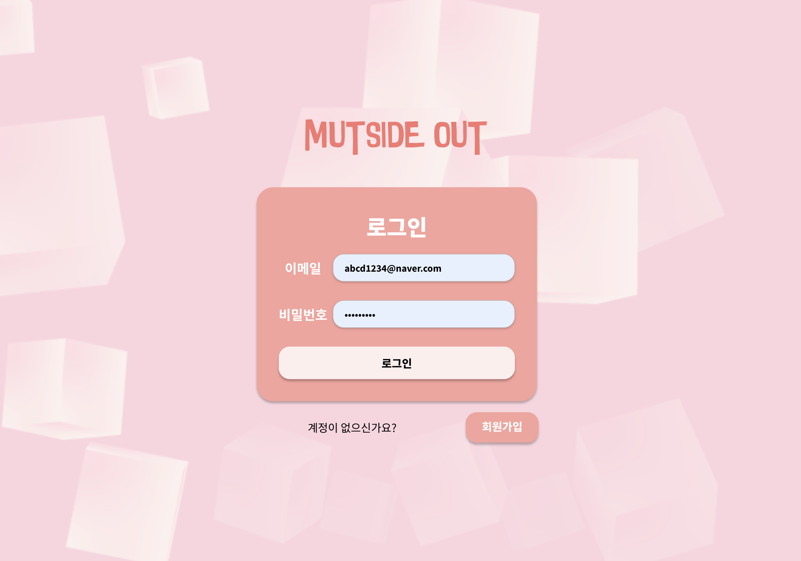
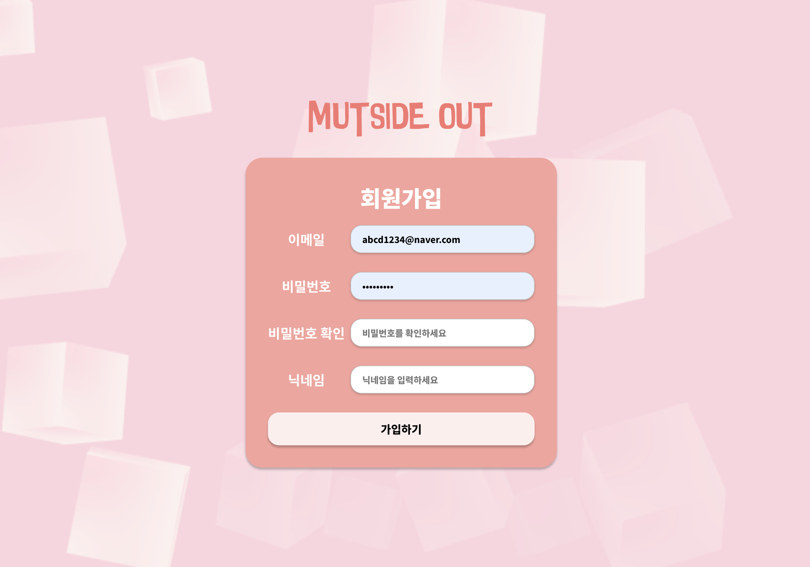
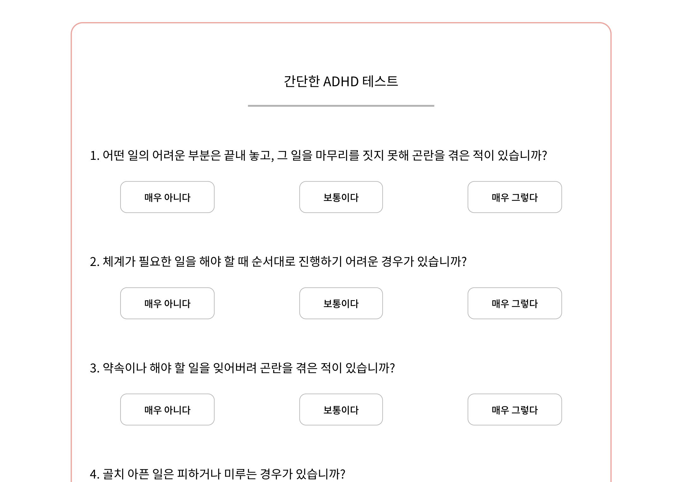
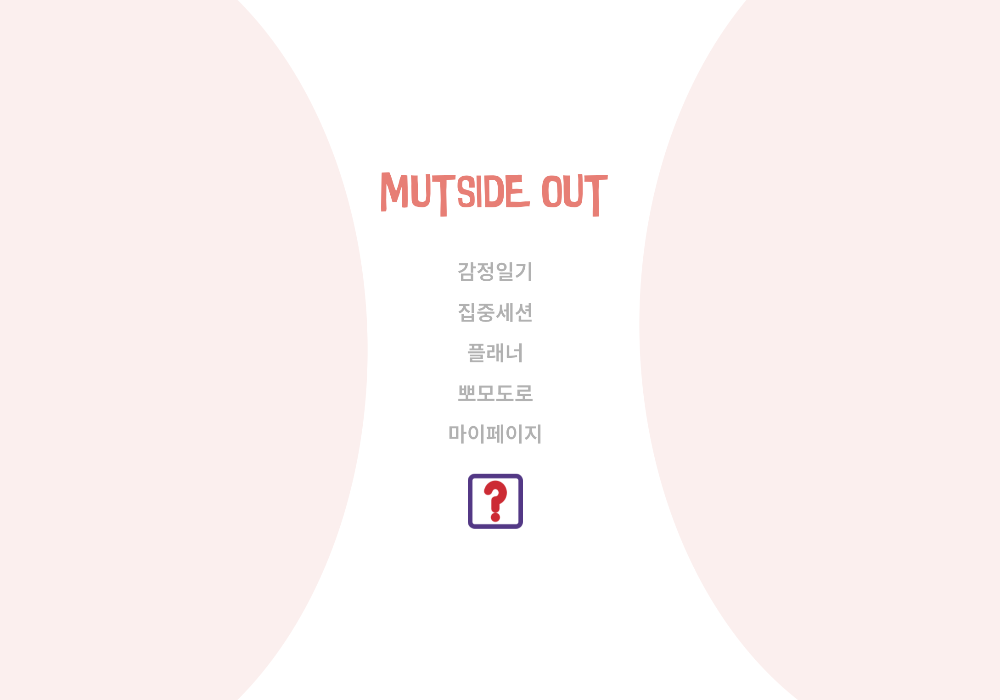
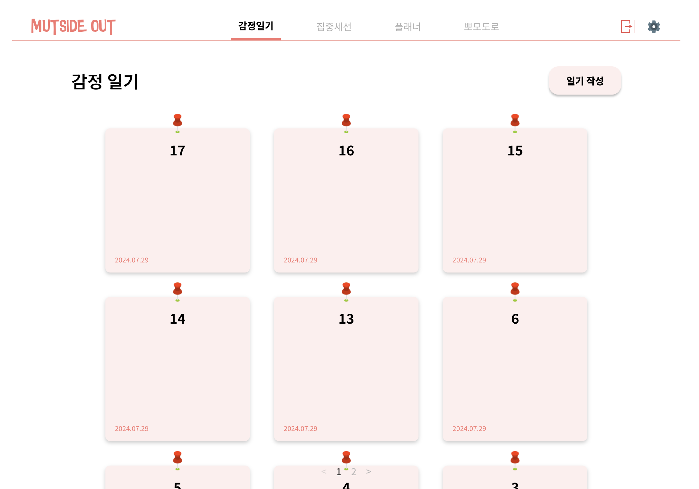
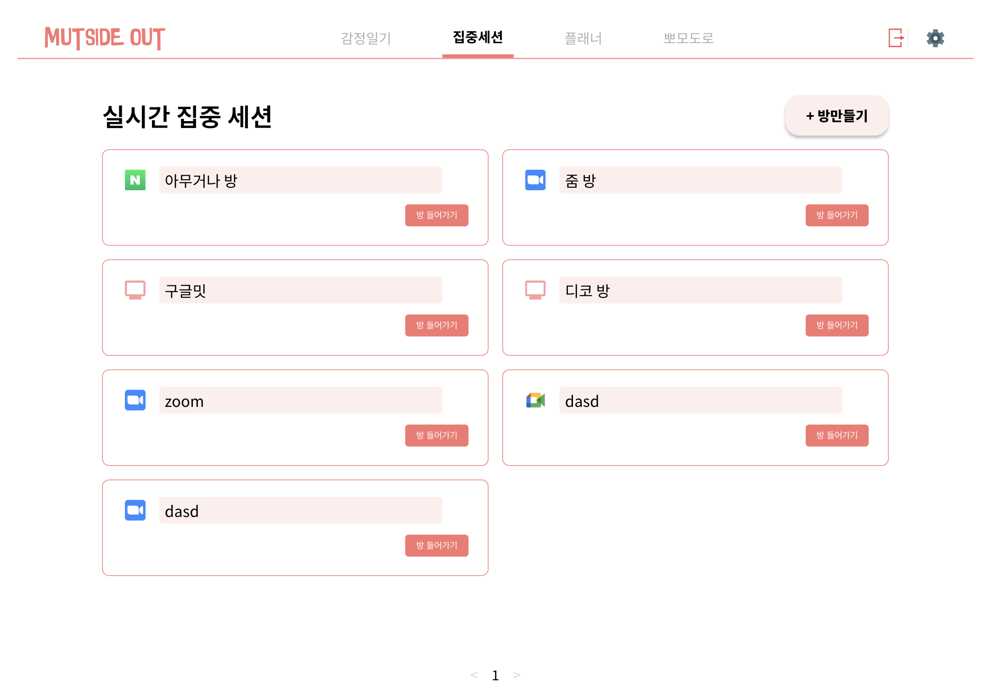
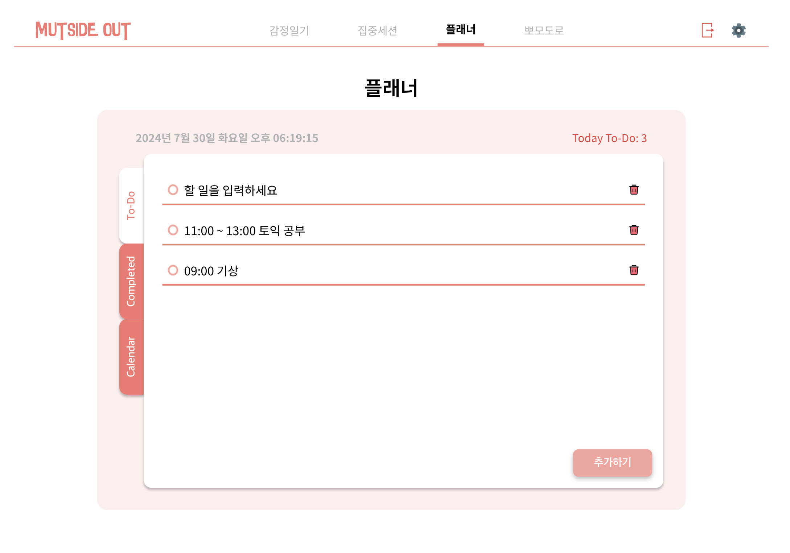
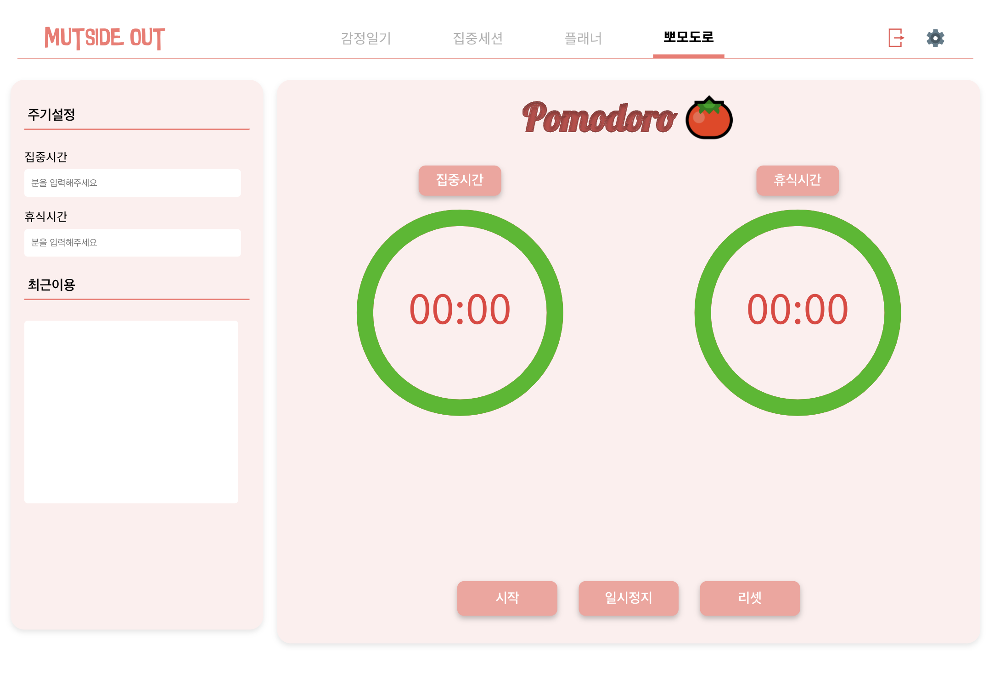

<div align=center>
	<h1>명지대(자연) 해커톤 2조</h1>
</div>

<br>

<div align=center>
	<h1>프로젝트 소개</h1>
</div>
	<h2> 이 앱은 여러분의 감정을 기록하고, 집중 세션을 통해 목표를 달성하는데
          도움을 주기 위해 만들어졌습니다.</h2>

<br>

<div align=center>
	<h1>Main Function 🗺️</h1>
</div>
	<h3>☝️ <strong>감정일기:</strong> 부정적인 생각, 감정과 충동을 관리하기 위한 일일 감정 기록 기능</h3>
	<h3>☝️ <strong>집중 세션:</strong> 특정 시간에 사용자들이 함께 집중 세션에 참여하여 실시간으로 진행 상황을 공유하고 서로 응원할 수 있는 기능</h3>
	<h3>☝️ <strong>플래너:</strong> 사용자가 하루에 달성할 작은 목표를 설정하고 진행 상황을 추적</h3>
	<h3>☝️ <strong>뽀모도로:</strong> 25분간 집중해서 일을 한 다음 5분간휴식하는 뽀모도로 타이머 제공</h3>
<hr/>

<br>

<div align=center>
	<h1>화면 구성 🖥️</h1>
	
	
	
	
	
	
	
	
</div>
<hr/>

<br>

<div align=center>
	<h1> 🤔 How to start? </h1>
</div>

```bash
# git clone
$ git clone https://github.com/mju-likelion/hackathon-team2-web.git

# installation
$ yarn install

# development
$ yarn start
```

<br>

<div align=center>
	<h1>🐹 Developers</h1>
	
|  |  |  |  |  |
| :--------------------------------------------------: | :------------------------------------------------------: | :-----------------------------------------------------: | :----------------------------------------------------------: | :--------------------------------------------------------------------------------------------------------------------------------: |
|         [유민기](https://github.com/youminki)          |         [김희수](https://github.com/Heesu01)          |         [구본승](https://github.com/rnqhstmd)          |         [백가현](https://github.com/GahBaek)     |                         [최현서](https://github.com/aaahyunseo)       |
|                       FrontEnd                       |                         FrontEnd                          |                        BackEnd                         |                           BackEnd                           |                                                              BackEnd                                                              |

</div>

<br>

<div align=center>
	<h1>🐟 Stacks</h1>

### Environment


### Config


### Development


### Communication


</div>

<br>

<div align=center>
	<h1>✅ Convention</h1>

### Branch Naming Convention 🪵

| 머릿말  | 설명                               |
| ------- | ---------------------------------- |
| main    | 서비스 브랜치                      |
| develop | 배포 전 작업 기준                  |
| feat    | 기능 단위 구현                     |
| hotfix  | 서비스 중 긴급 수정 건에 대한 처리 |

### Commit Convention 🚥

| 머릿말   | 설명                                                 |
| -------- | ---------------------------------------------------- |
| feat     | 기능 구현, 추가                                      |
| fix      | 버그 수정, 예외 케이스 대응, 기능 개선               |
| design   | UI 디자인                                            |
| setting  | 패키지 설치, 개발 설정                               |
| refactor | 코드 리팩터링                                        |
| style    | 코드 스타일 수정 (code formatting, 세미콜론 추가 등) |
| rename   | 파일명(or 폴더명)을 수정한 경우                      |
| test     | 테스트 코드 추가                                     |
| docs     | README.md 작성 및 변경                               |
| hotfix   | 치명적인 버그를 급하게 수정하는 경우                 |

### Naming Rule 📄

| 머릿말            | 설명                             |
| ----------------- | -------------------------------- |
| Components        | PascalCase                       |
| State variables   | (boolean values) is, has, should |
| Event handlers    | handle                           |
| Constants         | UPPER_SNAKE_CASE                 |
| Utility functions | camelCase                        |

</div>

<br>


